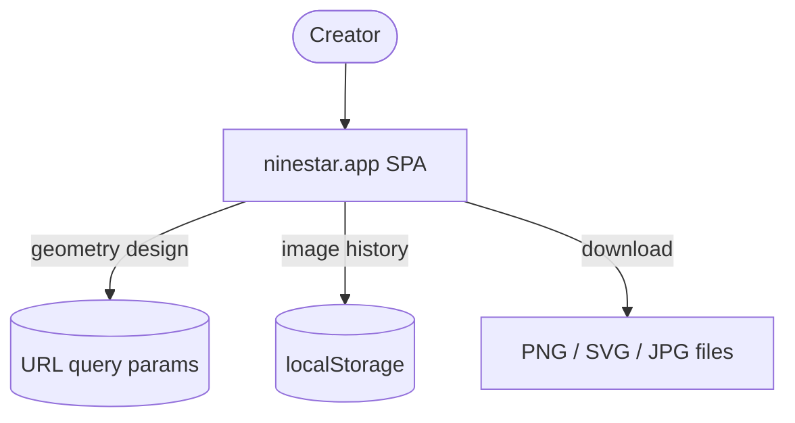
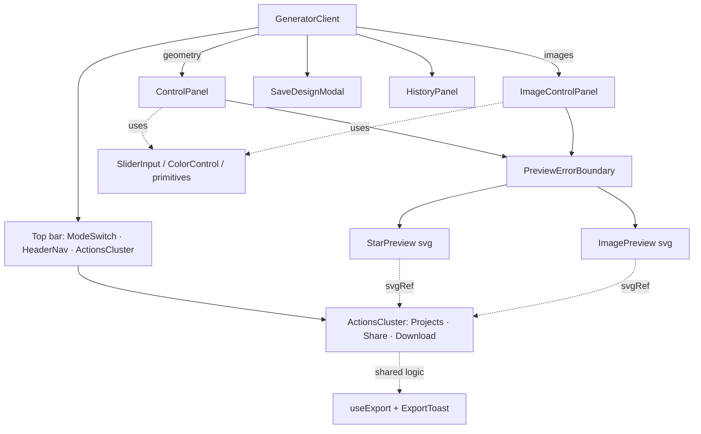

## Context

A single-page, client-only app. The only external touchpoint is the user's
browser storage (URL + localStorage). No server, no API.

## Components

`GeneratorClient` is the shell. It holds the active **mode**, both config hooks
(`useStarComposition` for geometry layers, `useComposition` for images), the
history state, and the modals, and decides which control panel and which preview
to render. The geometry control panel and single-config URL sync still speak a
flat `StarConfig`, derived from the selected layer via `configFromLayer`; the
multi-layer URL scheme and layer UI are follow-up cycles.

**Top bar.** On the home route the generator renders its own full-width top bar
(logo + colored `ModeSwitch` + `HeaderNav` + `ActionsCluster`); the standalone
`AppHeader` is suppressed there by [SiteHeader](components/SiteHeader.tsx)
(`usePathname() === '/'` → null) and only shows on other routes. Both reuse the
shared `Wordmark` and `HeaderNav` (Templates modal auto-opened on first visit,
About, the "What's new" dialog — [WhatsNewDialog](components/WhatsNewDialog.tsx)
fed by [lib/changelog.ts](lib/changelog.ts)). `ModeSwitch`
([components/generator/](components/generator/ModeSwitch.tsx)) is the mode
control (lifted out of the sidebar); its active pill is accent-filled so it
shows and drives the indigo/teal theme. `ActionsCluster` bundles Projects · Share
· Download into one header container (replacing the former canvas overlays,
sidebar export panel, and mobile FAB — one export path via
[useExport](hooks/useExport.ts)). The **Projects** button opens the panel that
both lists download history and restores a design from an uploaded file; a
one-time first-visit nudge appears beneath it. The canvas is now free of chrome. Control
panels draw color input from the shared `ColorControl`, whose swatch popover is
built on [ui/popover.tsx](components/ui/popover.tsx) (Base UI).

Both previews render into the **same `svgRef`**, which is all the export
pipeline needs — so PNG/SVG/JPG export is identical for both modes. They are
wrapped in [PreviewErrorBoundary](components/PreviewErrorBoundary.tsx) so a
corrupted design (e.g. restored from history) can't take down the editor.

Export runs through a single UI now: the header
[ActionsCluster](components/generator/ActionsCluster.tsx) download menu, backed
by the [useExport](hooks/useExport.ts) hook (which owns the canonical
`RESOLUTIONS` list) and [ExportToast](components/ExportToast.tsx). (The old
desktop `ExportPanel` and mobile `MobileExportFab` were removed in R1.)

## Rendering & export pipeline

Everything is **SVG**, on a fixed `600×600` viewBox centred at `(300,300)`.

- **Geometry**: [lib/star-geometry.ts](lib/star-geometry.ts) builds path strings
  from `StarConfig`; [StarPreview](components/StarPreview.tsx) renders them with
  gradients, filters (glow/shadow), and an optional container.
- **Images**: [ImagePreview](components/ImagePreview.tsx) places each visible
  layer `count` (or `2×count` when mirrored) times via SVG `transform`, each an
  `<image href="data:…">`.
- **Render cost / re-render isolation**: `GeneratorClient` holds all state, so a
  slider tick would re-render the whole tree — the app is structured so the
  *expensive* work bails out instead. The rules:
  - **Stable identities.** The hook layer callbacks (`useStarComposition` /
    `useComposition`) are `useCallback([])` — add/duplicate/remove read the latest
    layers from a ref, and `toggleLayerVisible` uses a functional updater — so they
    never churn. `GeneratorClient` memoizes `exportProps`/`layerProps` and derives
    download/history handlers from refs, keeping them stable across ticks.
  - **memo boundaries.** The whole chrome is `memo()`: `ModeSwitch`, `HeaderNav`,
    `LogoStar`, `ActionsCluster`, `ControlPanel`, `ImageControlPanel`,
    `LayersPanel`, plus per-row `LayerRowItem` and per-layer `LayerThumb`. With
    stable props, only the parts whose data actually changed re-render.
  - **Stable slider props.** Control panels pass module-level formatters
    (`fmtInt`/`fmtDeg`/…) and per-key change handlers built once (a record keyed to
    `update`), so `memo(SliderInput)` re-renders only the one slider being dragged.
  - **Narrow useMemo deps.** `StarLayerGroup` depends only on the geometric fields
    `buildStarPaths` reads, so a colour/opacity change re-applies attributes without
    rebuilding path strings. Corner/type previews use precomputed static configs.
  - Both previews are `memo()`-wrapped and compute geometry/placements in `useMemo`;
    the preview `style` prop is a module constant. (Measured: a 5-layer slider drag
    went from every region re-rendering to the chrome bailing out — see changelog.)
- **Export**: [lib/export.ts](lib/export.ts) serialises the `<svg>` behind
  `svgRef`. SVG is downloaded directly (self-contained, images inlined); PNG/JPG
  are drawn onto a canvas at the chosen resolution. Because uploaded images are
  **data URLs**, the canvas is never tainted (see ADR-002).
- **Embedded restore metadata (geometry)**: geometry exports carry their own
  shareable link inside the file's metadata, so a downloaded file is a restore
  point — re-uploading rebuilds the design **from the embedded link, not the
  pixels**. [lib/project-metadata.ts](lib/project-metadata.ts) owns one codec used
  in both directions: the payload's meaningful content is the exact same query
  string `compositionToParams` writes to the URL, so URL and file are identical by
  construction. It embeds per container — SVG `<metadata>`, PNG `tEXt` chunk (with
  hand-rolled CRC-32), JPEG `COM` marker — and `extractProjectFromFile()` reads it
  back, then `paramsToComposition` reconstructs the layers (see ADR-009). Images
  mode carries no metadata (image designs aren't link-encodable).

## State

- [useStarComposition](hooks/useStarComposition.ts) — `GeometryComposition`
  (layer list + canvas) for geometry, with add/duplicate/remove/update/reorder +
  the selected-layer id.
- [useComposition](hooks/useComposition.ts) — `CompositionConfig` (image layer
  list + background/container/export) with add/remove/update/reorder.
- [useUrlSync](hooks/useUrlSync.ts) — debounced two-way sync of the geometry
  composition with the URL query string. Image state is **not** URL-synced.
- History lives in `GeneratorClient` state, backed by
  [lib/history.ts](lib/history.ts) (`localStorage`).

## Theming

A per-mode accent is implemented with CSS variables (`--nsg-accent`, …) defined
in [globals.css](app/globals.css) and overridden to teal on the
`GeneratorClient` root when in images mode. Shared components reference
`var(--nsg-accent…)`, so they re-theme automatically by subtree (see ADR-004).

## Key decisions

The consequential choices live in the **Architecture decisions** section: SVG +
data-URL export, no backend, URL-state for geometry only, localStorage history,
and CSS-variable theming.
