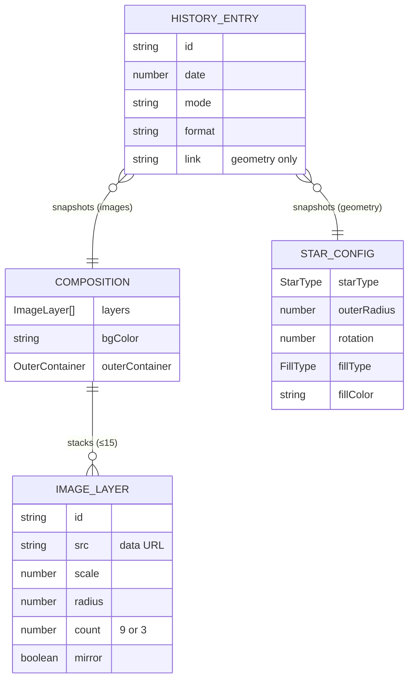

There is no database. The "data" is three in-memory/persisted config shapes.

## Relationships



## StarConfig — geometry

Defined in [types/star.ts](types/star.ts). ~30 fields covering shape
(`starType`, `outerRadius`, `innerRadiusRatio`, `rotation`, `curveIntensity`,
`cornerRounding`), fill/stroke/gradient, background, outer container, effects
(glow/shadow), petal params, and export size. `DEFAULT_CONFIG` holds the
defaults (e.g. `outerRadius: 250`). Serialised compactly to URL params via
[lib/url-params.ts](lib/url-params.ts) (short key map). `StarConfig` remains the
legacy single-star vocabulary (presets, old URLs, old history); the live
geometry state is now a **GeometryComposition** (below).

## GeometryComposition & GeometryLayer — geometry layers

Defined in [types/geometry.ts](types/geometry.ts). Geometry mode stacks several
generated stars, mirroring the images layer model.

- **GeometryLayer**: the per-star subset of `StarConfig` (`StarShapeProps` —
  shape, fill/stroke/gradient, effects, petal params) **plus** `id`, `name`,
  `visible`, `opacity`, and `offsetX`/`offsetY` (move the star's centre off the
  viewBox centre). There is **no `scale`**: `outerRadius` already is the size of
  a generated star.
- **GeometryComposition**: `layers[]` (rendered bottom→top, list reversed in the
  UI) plus the canvas-level fields `bgColor`, outer-container fields, and export
  size. `MAX_GEOMETRY_LAYERS = 15` (matches images).
- **`compositionFromConfig(StarConfig)`** is the single backward-compat seam:
  legacy single-star URLs, presets, and history entries load as a one-layer
  composition. `asComposition()` accepts either shape; `configFromLayer()`
  projects the selected layer + canvas back to a flat `StarConfig` for the parts
  of the UI that still speak it. `useStarComposition` (twin of `useComposition`)
  owns layer ops + the selected-layer id. Full multi-layer designs are shareable
  via the URL (scheme below) and restore from local history.
- The outer container wraps the **largest visible** layer's radius (with one
  layer this is identical to the pre-layer behaviour). Each rendered layer gets
  **its own gradient/filter ids** (via `useId`) so stacked gradients/effects
  never cross-bleed. Hidden layers skip rendering (and their defs) entirely.

> [!NOTE]
> **URL scheme (multi-layer).** Canvas fields use bare short keys (`bg`, `oc`,
> …). Layer 0 also uses bare per-star keys, so a single-star design encodes
> **byte-identically to the pre-layer scheme** — every old shared link still
> parses. Layers 1+ prefix their keys with the layer index; the index is the
> **leading digits**, so two-digit indices (layers 10–14) parse via
> `^(\d+)([a-z].*)$`. `n=<count>` marks multi-layer compositions (so an
> all-default extra layer still round-trips). A handful of tweaked layers stay
> well under the ~2k URL budget; maxing every field on all 15 layers makes a long
> (but still working) share link — an acceptable edge. See
> [lib/url-params.ts](lib/url-params.ts) (`compositionToParams`/`paramsToComposition`).

## Embedded project metadata — the downloadable file as a restore point

Defined in [lib/project-metadata.ts](lib/project-metadata.ts). Geometry exports
embed their build instructions in the file's metadata so a downloaded file can be
re-uploaded to rebuild the design. The payload is a tiny JSON wrapper whose
meaningful content **is** the shareable URL:

```json
{"app":"ninestar.app","v":1,"url":"https://ninestar.app/?t=…&r=…&n=2"}
```

- **One standard, one codec.** `url`'s query string is produced by the same
  `compositionToParams` the URL uses and read back by the same
  `paramsToComposition` — so the embedded metadata and the shareable link are
  byte-identical by construction (verified by a round-trip harness). The `url` is
  built from the **live composition** at export time (not `window.location.href`),
  so it's immune to the 300 ms URL-sync debounce. `app` tags it for detection; `v`
  allows future migration.
- **ASCII-safe.** `URLSearchParams` percent-encodes and layer *names* never enter
  the URL, so the payload is pure ASCII and embeds safely as Latin-1 text in every
  container.
- **Per-container embedding.** SVG → a render-invisible `<metadata>` element; PNG →
  a `tEXt` chunk spliced before `IEND` (CRC-32 computed in-house); JPEG → a `COM`
  marker after `SOI`. `extractProjectFromFile()` returns
  `{ ok, composition } | { ok:false, reason }` where `reason` is `unsupported`
  (wrong type), `unreadable` (corrupt container), or `no-data` (a valid image with
  no ninestargen payload — the common "not one of ours" case).

> [!NOTE]
> SVG is the most robust (plain text, never recompressed). PNG/JPEG survive a
> normal download→reupload, but a raster picked from the **iOS Photos library**
> (vs the Files app) or routed through an app that re-encodes may lose its
> metadata — the UI shows the friendly "no design found" message. Images mode
> carries no metadata (image designs aren't link-encodable).

## CompositionConfig & ImageLayer — images

Defined in [types/composition.ts](types/composition.ts).

- **ImageLayer**: `src` (data URL), intrinsic `naturalWidth/Height`, `visible`,
  and the controls `scale`, `radius`, `spin`, `angleOffset` (UI label "Angle"),
  `offsetX`/`offsetY` (shift the image off-centre within each copy), `count`
  (`9 | 3`), `mirror` (boolean), `opacity`. `LAYER_LIMITS` defines slider
  bounds/defaults; `makeLayer()` builds a fresh layer.
- **CompositionConfig**: `layers[]` (rendered bottom→top; the UI list is
  reversed so top = front), plus `bgColor`, outer-container fields, and export
  size. `MAX_LAYERS = 15`.

> [!NOTE]
> Layers are stored back-to-front (array index 0 = bottom). Reorder maps a
> displayed "up" to `+1` in array order — see the **Workflows** section.

## HistoryEntry — local history

Defined in [lib/history.ts](lib/history.ts). One snapshot per download:
`{ id, date, mode, format, config, link? }`. The `config` is a geometry design
(`StarConfig` for pre-layer entries, `GeometryComposition` for newer ones —
`normalizeEntry` accepts both) **or** a `CompositionConfig` (images include
their data URLs, which is what makes in-browser restore possible). Persisted to `localStorage` under
`nsg:history`, newest first, capped at 12 and trimmed to fit the storage quota.
`link` is only set for geometry (image designs are not URL-encodable).

`addHistory()` returns `{ entries, trimmed }`: `trimmed` is `true` when the
quota forced entries to be dropped, and `SaveDesignModal` then shows a storage
warning instead of losing history silently. Consecutive downloads of the same
design are deduped via `configSignature()`, which folds long strings (data
URLs) to length+head+tail rather than serialising multi-MB payloads.

### Persistence & forward/backward compatibility

History must keep working across future app updates — a stored snapshot should
never be wiped or break just because the config shape changed. Two mechanisms
guarantee this (see ADR-006):

- **Versioned envelope.** Data is written as `{ version, entries }`
  (`SCHEMA_VERSION`). `loadHistory()` also still reads the legacy bare-array
  format, so existing users lose nothing.
- **Normalize on load.** Every entry passes through `normalizeEntry()` (and each
  image layer through [`normalizeLayer()`](types/composition.ts)): the config is
  merged over the **current defaults** (`DEFAULT_CONFIG` / `DEFAULT_COMPOSITION`),
  so fields **added** in newer versions are filled in and old snapshots render
  correctly. A single malformed entry returns `null` and is dropped on its own —
  it never invalidates the rest of the list.

> [!NOTE]
> Additive schema changes (new fields) need **no** version bump — normalization
> handles them. Bump `SCHEMA_VERSION` and add an explicit migration only for a
> breaking change (a renamed/retyped field that defaults can't repair).

## Presets (templates)

Defined in [lib/presets.ts](lib/presets.ts). A `Preset` is `{ id, name,
category, config }` with an optional `composition` — **multi-layer showcase**
presets (e.g. *Emerald Weave*, a stacked enneagram + triple-triangle) carry a
full `GeometryComposition`; single presets carry just a `StarConfig`.
`presetToComposition()` ([lib/preset-normalization.ts](lib/preset-normalization.ts))
is the one place that resolves either into the composition used for **both** the
preview and the applied state, so a template's card and its result always match.
Applying dispatches `nsg:apply-preset` with that composition; the URL is
`compositionToParams(...)`.

## localStorage keys (complete list)

All persistence is client-side. Every key the app writes:

| Key | Owner | Content |
| --- | --- | --- |
| `nsg:history` | [lib/history.ts](lib/history.ts) | versioned envelope of download snapshots (above) |
| `nsg:recent-colors` | [lib/recent-colors.ts](lib/recent-colors.ts) | JSON array of up to 8 hex colors, newest first, deduped |
| `nsg:version-seen` | [lib/changelog.ts](lib/changelog.ts) | last `APP_VERSION` whose changelog the visitor saw |
| `nsg:projects-hint-seen` | [GeneratorClient](app/GeneratorClient.tsx) | `"1"` once the one-time "continue where you left off" nudge under the Projects button has shown |
| `templates_seen` | `HeaderNav` | `"1"` once the auto-opened templates modal was closed |

All reads/writes are wrapped in `try/catch` — a full or unavailable storage
degrades features (no recents, dot shows again) but never breaks the app.
