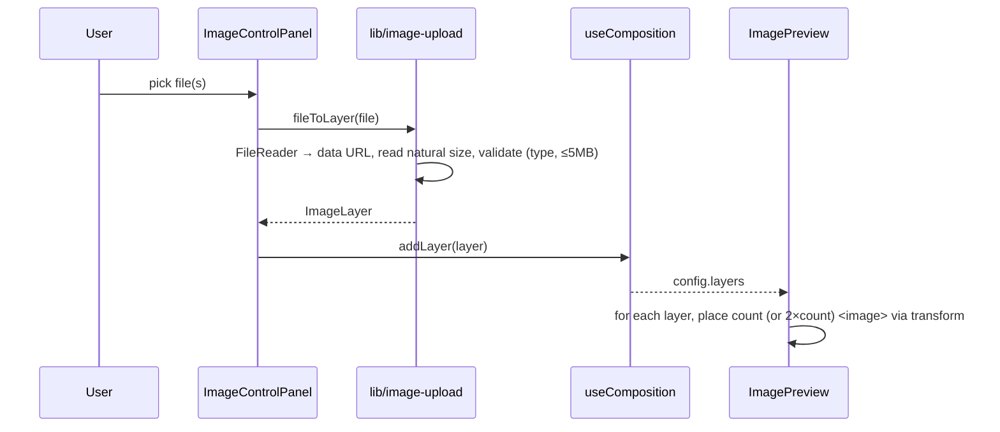
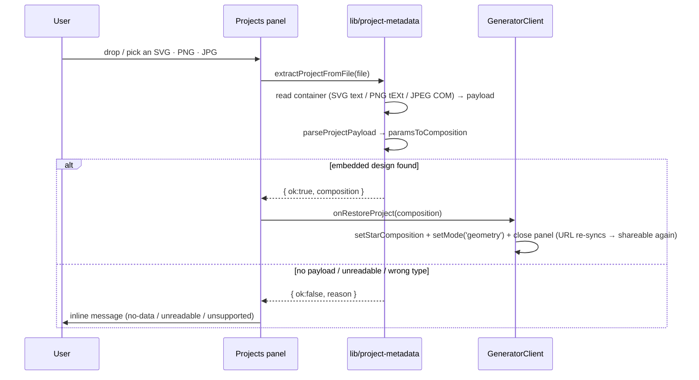

## Image upload → nine-fold mandala



Placement math (per layer, `count ∈ {9,3}`, step `360/count`): each copy is
`translate(300,300) rotate(A) translate(0,-radius) translate(offsetX,offsetY) rotate(spin)`.
The `offsetX/offsetY` tail nudges the image off-centre within its sector (0,0 =
centred); `radius` sets the sector distance and `spin` rotates the image about
its own (shifted) centre. When `mirror` is on, a second `scale(-1,1)` copy per
sector adds reflection symmetry (kaleidoscope) — the offset mirrors with it. The canvas CTA in the empty state and the sidebar button both
open the same file picker (via a `nsg:add-image` event).

## Export

```mermaid
sequenceDiagram
  participant U as User
  participant EP as ExportPanel
  participant EX as lib/export
  participant GC as GeneratorClient
  U->>EP: choose size + format
  EP->>EX: exportSVG / exportRaster(svgRef, …, metadata)
  Note over EP: metadata = buildProjectPayload(live composition) — geometry only
  EX->>EX: serialise <svg>; SVG direct, or draw to canvas → PNG/JPG
  EX->>EX: embed payload (SVG <metadata> / PNG tEXt / JPEG COM)
  EX-->>U: file download (with embedded restore link)
  EP->>GC: onDownloaded(format)
  GC->>GC: addHistory(snapshot) + open SaveDesignModal
```

Download is disabled in images mode when there are no layers (nothing to
export). Geometry exports embed the shareable link in the file's metadata via
[lib/project-metadata.ts](lib/project-metadata.ts) (a thunk `getMetadata` keeps it
lazy + memo-stable), so the file itself is a restore point — see the next flow.
The `SaveDesignModal` link + Share still use `window.location.href`.

## Projects panel — restore from history or from a file

The **Projects** panel (`HistoryPanel`, opened from the header) has two ways back
into a design: restore a recent **download** (history, below), or **upload a file**
you exported earlier.

```mermaid
sequenceDiagram
  participant GC as GeneratorClient
  participant H as lib/history (localStorage)
  participant HP as Projects panel (HistoryPanel)
  GC->>H: addHistory({mode, format, config, link?})
  Note over H: newest-first, dedupe vs last, cap 12, quota-trim
  HP->>H: loadHistory() on open
  HP->>GC: onRestore(entry)
  GC->>GC: geometry → setStarComposition(asComposition); images → comp.setConfig + setMode('images')
```

Because image snapshots store their data URLs, restoring an image design brings
the actual layers back — the user can keep editing it in the same browser.
Geometry snapshots may be either shape (a legacy flat `StarConfig` or a
`GeometryComposition`); `asComposition()` normalizes both back into the live
layer state on restore.

### Restore from an uploaded file



The file is only a **carrier for the link** — the design is rebuilt from the
embedded query string (same codec as the URL), never traced from the pixels.
Restoring re-runs `useUrlSync`, so the restored design is immediately shareable
again. Only Geometry files carry this data; image mandalas can't be restored this
way (they'd need their multi-MB data URLs, which don't fit).

## Layers (both modes, same surface)

The layer stack renders through one shared `LayerList` — a floating `LayersPanel`
over the canvas on desktop, a Controls/Layers sidebar toggle on mobile.
`GeneratorClient` builds one `layerProps` set per mode (geometry from
`useStarComposition`, images from `useComposition` — both now expose a selected
layer + `duplicateLayer`). Selecting a row makes the property sections edit that
layer.

The list is shown reversed (top = front = end of array). The **up** button moves
a layer toward the front (`reorderLayer(id, +1)`), **down** toward the back
(`-1`); the reorder swaps array neighbours and ignores out-of-bounds moves.
Delete is disabled below `minLayers` (geometry needs ≥1; images may reach 0).
