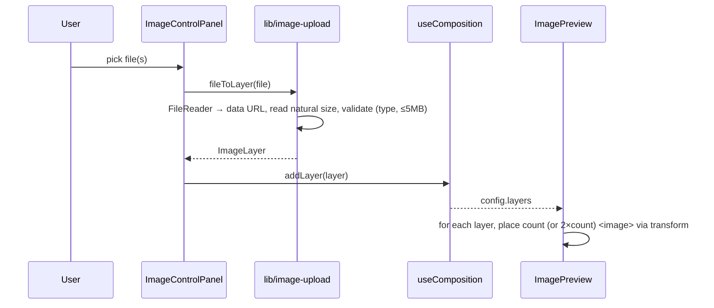

## Image upload → nine-fold mandala



Placement math (per layer, `count ∈ {9,3}`, step `360/count`): each copy is
`translate(300,300) rotate(A) translate(0,-radius) translate(offsetX,offsetY) rotate(spin)`.
The `offsetX/offsetY` tail nudges the image off-centre within its sector (0,0 =
centred); `radius` sets the sector distance and `spin` rotates the image about
its own (shifted) centre. When `mirror` is on, a second `scale(-1,1)` copy per
sector adds reflection symmetry (kaleidoscope) — the offset mirrors with it. The canvas CTA in the empty state and the sidebar button both
open the same file picker (via a `nsg:add-image` event).

## Export

```mermaid
sequenceDiagram
  participant U as User
  participant EP as ExportPanel
  participant EX as lib/export
  participant GC as GeneratorClient
  U->>EP: choose size + format
  EP->>EX: exportSVG / exportRaster(svgRef, …)
  EX->>EX: serialise <svg>; SVG direct, or draw to canvas → PNG/JPG
  EX-->>U: file download
  EP->>GC: onDownloaded(format)
  GC->>GC: addHistory(snapshot) + open SaveDesignModal
```

Download is disabled in images mode when there are no layers (nothing to
export). Geometry exports use `window.location.href` as the shareable link.

## Save & restore from history

```mermaid
sequenceDiagram
  participant GC as GeneratorClient
  participant H as lib/history (localStorage)
  participant HP as HistoryPanel
  GC->>H: addHistory({mode, format, config, link?})
  Note over H: newest-first, dedupe vs last, cap 12, quota-trim
  HP->>H: loadHistory() on open
  HP->>GC: onRestore(entry)
  GC->>GC: geometry → setStarComposition(asComposition); images → comp.setConfig + setMode('images')
```

Because image snapshots store their data URLs, restoring an image design brings
the actual layers back — the user can keep editing it in the same browser.
Geometry snapshots may be either shape (a legacy flat `StarConfig` or a
`GeometryComposition`); `asComposition()` normalizes both back into the live
layer state on restore.

## Reorder layers

The list is shown reversed (top = front = end of array). The **up** button
moves a layer toward the front (`reorderLayer(id, +1)`), **down** toward the
back (`-1`); `useComposition.reorderLayer` swaps array neighbours and ignores
out-of-bounds moves.
